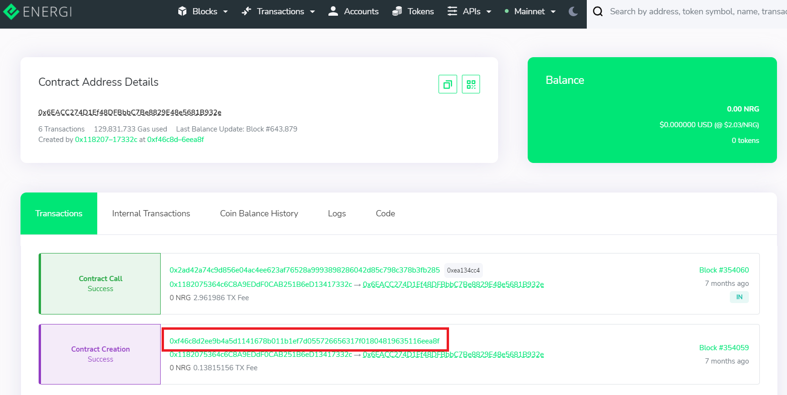
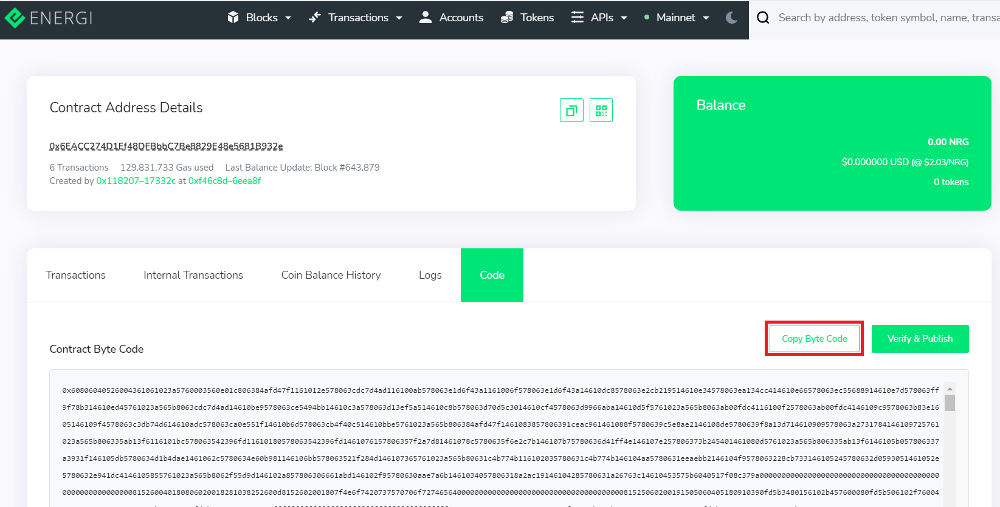
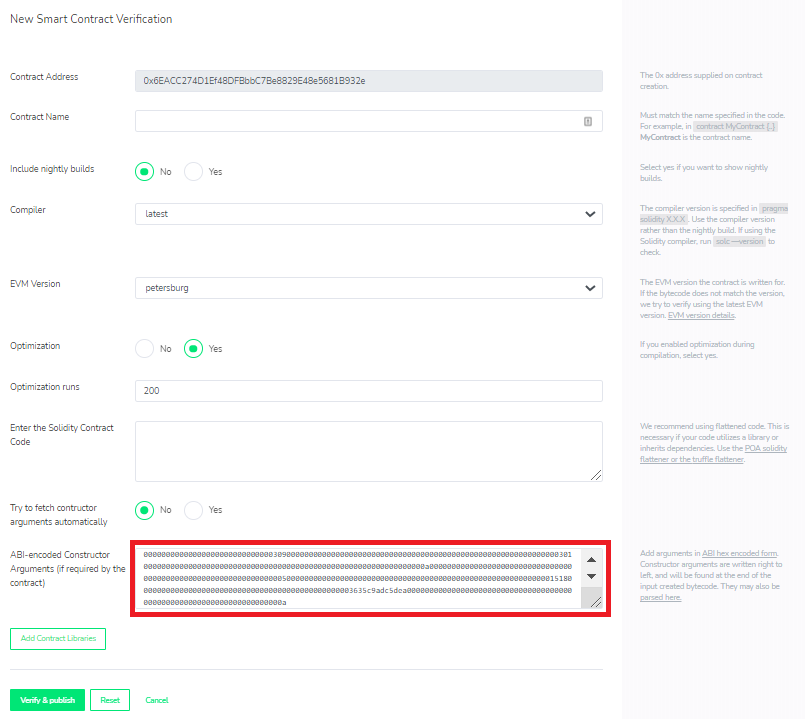

# ABI-Encoded Constructor Arguments

If Constructor Arguments are required by the contract, you will add them to the Constructor Arguments field in [ABI hex encoded form](https://solidity.readthedocs.io/en/develop/abi-spec.html). Constructor arguments are appended to the END of the contract source bytecode when compiled by Solidity.

An easy way to find these arguments is to compare the `raw input` code in the transaction details to to the contract creation code in the code section of the contract.

When are constructor arguments used?

> _From the Solidity docs:_ When a contract is created, its [constructor](https://solidity.readthedocs.io/en/v0.5.3/contracts.html#constructor) \(a function declared with the `constructor` keyword\) is executed once.
>
> A constructor is optional. Only one constructor is allowed, which means overloading is not supported.
>
> After the constructor has executed, the final code of the contract is deployed to the blockchain. This code includes all public and external functions and all functions that are reachable from there through function calls. The deployed code does not include the constructor code or internal functions only called from the constructor.

### Steps to include Constructor Arguments when verifying a contract.

1\) Access the contract creation TX in BlockScout. This is the transaction that created the contract, not the address of the actual contract. You should see a link to it in your wallet history.

2\) Go to the transaction details page for the contract creation TX. Within the details, you will see the Raw input. Copy this input in Hex format and paste into a txt or spreadsheet where you will compare against a second ABI code.

3\) Go to the contract creation address. You can access through the transaction details at the top:

4\) In Contract Address Details, click on the Code tab.

5\) Copy Contract Byte Code.

6\) Paste into a document next to the original raw input ABI. This will allow you to compare the two. Anything that appears at the **END** of the Raw input code that does not exist at the end of the Contract Code is the ABI code for the constructor arguments.

| Raw ABI Code \(truncated\) | Contract Byte Code\(truncated\) |
| :--- | :--- |
| 0x60806040523480156200001157600080 .... d51968d7ee1cecb7c5084f233a8eca67eecddd 45e13c4bca7f 64736f6c63430005100032**000000000000000000000000000000000000000000000000000000000000 03020000000000000000000000000000000000000000000000000000000000000309000000000000 00000000000000000000000000000000000000000000000003010000000000000000000000000000 00000000000000000000000000000000000a00000000000000000000000000000000000000000000 00000000000000000005000000000000000000000000000000000000000000000000000000000001 518000000000000000000000000000000000000000000000003635c9adc5dea00000000000000000 000000000000000000000000000000000000000000000000000a** | 0x60806040526004361061023a57600035 .... df6a91bab76cc5f57fe17652003a9e08f52fa5412c9a861f1f8 64736f6c63430005100032 |

The code may differ in other ways, but the constructor arguments **will always appear at the end**. Copy this extra code and paste into the constructor arguments field along with the other information needed to verify your contract.

